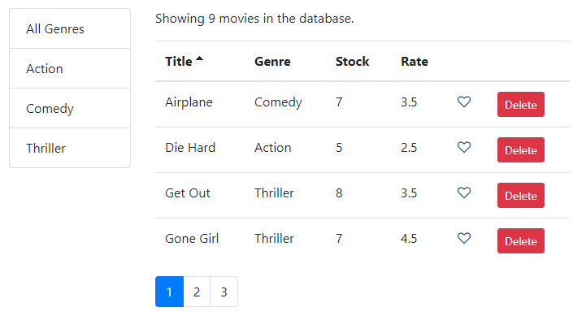

# React Composing Components


## About examples:

How to use props to pass data to your component, Raise and Handling Events, Lifting the State and with this texhnique, we could have multiple components that shared the same data, and were in sync. Functional components and life cycle hooks. Add pagination, sorting and searching.
I used this lodash methods: _.get(), _.slice(), _.take(), _.range(), \_.orderBy()

## Project screenshot:



```
yarn install
yarn start
```
